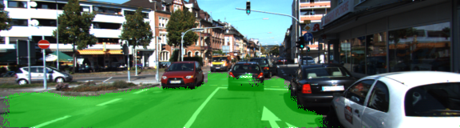

## Model architecture

The model replicates [FCN-8](https://people.eecs.berkeley.edu/~jonlong/long_shelhamer_fcn.pdf).

Here are the sizes of a few layers. `m` refers to the batch size.

```
input               [m 160 576 3]
encoder 3           [m 20 72 256]
encoder 4           [m 10 36 512]
encoder 7           [m 5 18 4096]
encoder 7 conv 1x1  [m 5 18 2]
decoder 4           [m 10 36 2]
decoder 3           [m 20 72 2]
decoder 1           [m 160 576 2]
logits              [(m * 160 * 576) num_classes]
```

It is important that both the height and the width of the input images be divisible by 32. Otherwise, one of encoder's convolution layers outputs an odd dimension, and when this is upsampled, the dimension would be mismatched against the corresponding shallower layer in the encoder. For example:

```
tensor_input            [m 720 1280 3]
encoder 3               [m 90 160 256]
encoder 4               [m 45 80 512]
encoder 7               [m 23 40 4096]
encoder 7 conv 1x1      [m 23 40 2]
upsampled for decoder 4 [m 46 80 2] <== dimension mismatch: 46 vs 45
encoder 4 conv 1x1      [m 45 80 2]
```

For further debugging, we can uncomment the use of `display_tensor_shapes` in `main.py`.

While testing and inferring, `tf.argmax(logits, axis=1)` is used to look at the highest-confidence classification for each pixel.

Learning rate is adjustable. It is reduced when loss is reduced beyond several arbitrary thresholds.

Batch size that is larger than 10 does not seem to work in an AWS `g3.4xlarge` instance.

The model generally started overfitting around 10 epochs, so the training cycles through only this many epochs.

The saver saves the model at the epoch with the best loss.


## Usage

To train, run `python main.py`. This outputs one saved model, at a path similar to:

```saved_sessions/2018-04-09T07-48-31/epoch9/model.*```

To apply the model to Kitti test dataset, run `python save_inference_samples.py saved_sessions/.../model`. Do not include an extension after `model`.

To annotate a video, run `python annotate_video.py saved_sessions/.../model input_video_path.mp4 output_video_path.mp4`.

Note, if we're using udacity's AMI, we need to `pip install moviepy` and `sudo apt-get install ffmpeg`.


## Results

```
after 1 epochs, loss was 0.5512736439704895, accuracy 0.7641059160232544
after 2 epochs, loss was 0.3141404688358307, accuracy 0.8810450434684753
after 3 epochs, loss was 0.20805242657661438, accuracy 0.9346305727958679
after 4 epochs, loss was 0.15245971083641052, accuracy 0.9512285590171814
after 5 epochs, loss was 0.12880197167396545, accuracy 0.9586407542228699
after 6 epochs, loss was 0.1355869472026825, accuracy 0.9506088495254517
after 7 epochs, loss was 0.10886410623788834, accuracy 0.9638527035713196
after 8 epochs, loss was 0.1606515347957611, accuracy 0.9469316601753235
after 9 epochs, loss was 0.06880798190832138, accuracy 0.9774052500724792
after 10 epochs, loss was 0.10268159955739975, accuracy 0.9630979895591736
```

The model saved after 9 epochs was automatically retained.

Here are some samples of annotated Kitti test dataset:





And, [this video](https://github.com/udacity/CarND-Object-Detection-Lab/blob/master/driving.mp4) was annotated, producing [annotated.mp4](https://ysono.github.io/CarND-T3P2-Semantic-Segmentation/doc/annotated.mp4).
